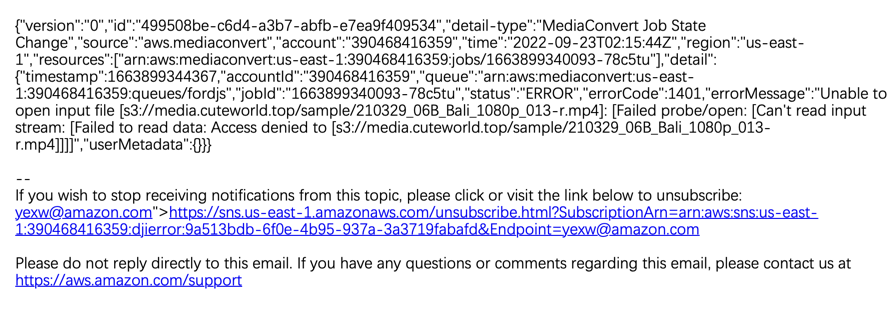

# AWS SDK Go v2 samples

参考： https://aws.github.io/aws-sdk-go-v2/docs/code-examples/

文档： https://pkg.go.dev/github.com/aws/aws-sdk-go-v2

使用方法： https://aws.github.io/aws-sdk-go-v2/docs/getting-started/

## MediaConvert sample

通过API创建转换任务

参考 mediaconvert.go

```bash
go run mediaconvert.go
```


## 疑问

### Element MediaConvert 

#### 是否有查询状态和取消的api，支持查询进度、状态和取消正在进行中的作业 

支持 (创建、取消、查询状态、列出任务) 
创建作业后会有一个job id, 可以根据这个ID去做后续的跟踪

源码参考: https://github.com/aws/aws-sdk-go-v2

#### 是否有办法在作业失败时候自动通知？

可以通过CloudWatch结合SNS做通知 （SNS可以通知email/webhook等）
参考： https://docs.aws.amazon.com/zh_cn/mediaconvert/latest/ug/mediaconvert_sns_rule_event_sourece.html

SNS通知如下：



#### 是否有处理的时候的详细日志

没有处理日志

#### 排队机制是啥，什么情况下会排队较长

作业处理可以选择需要加入的队列（队列有两种 - （一种是按需， 一种预留）
排队做资源转码- 使用按需
需要更多转码资源 - 使用预留队列（预留可以购买RTS转码槽）

限制： https://docs.aws.amazon.com/general/latest/gr/mediaconvert.html

>默认按需队列的并发转码数限制是： Concurrent jobs across all on-demand queues, baseline 40 可以申请提升

详情参考：
https://docs.aws.amazon.com/zh_cn/mediaconvert/latest/ug/about-reserved-queues.html

#### 是否可以设置作业优先级，让某个作业优先处理

可以设置， 优先级为-50 到 50 之间的值， 默认为0， 具体可以参考
https://docs.aws.amazon.com/zh_cn/mediaconvert/latest/ug/setting-the-priority-of-a-job.html